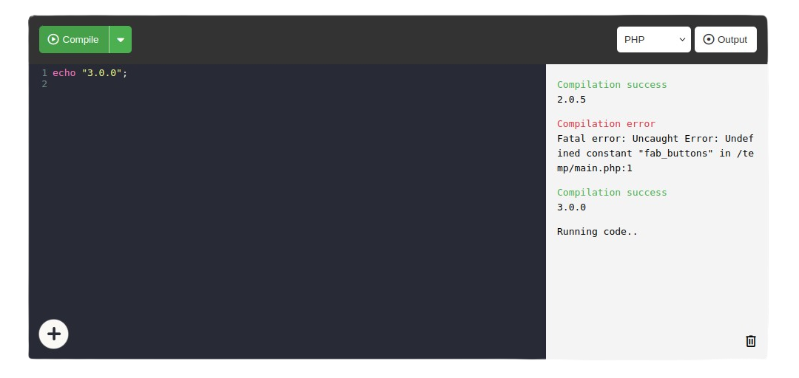

## Open Code Compiler

<p align="center">
    
</p>

### Install helper
```sh
# using make
make helper

# or manually
yarn install --cwd .helper
composer install --working-dir .helper
```

### Generate token
```sh
# using make
make token

# using php
php .helper/scripts/token.php

# using curl
curl -X POST -H "Content-Type: application/json" https://api.rivolink.mg/api/auth \
-d '{
  "username": "Anonymous",
  "password": "a439579cae86060066478decd838bc39"
}' | jq -r '.token // ""' > src/private/token.txt
```

### Build your own version
```sh
# using make
make build

# using php
php .helper/scripts/build.php
```

### Credits
This project uses :
- [Docker Code Compiler](https://github.com/RivoLink/docker-code-compiler)
- [João Fernandes - Floating Action Button](https://codepen.io/joaofnds/full/aBMLXj)
